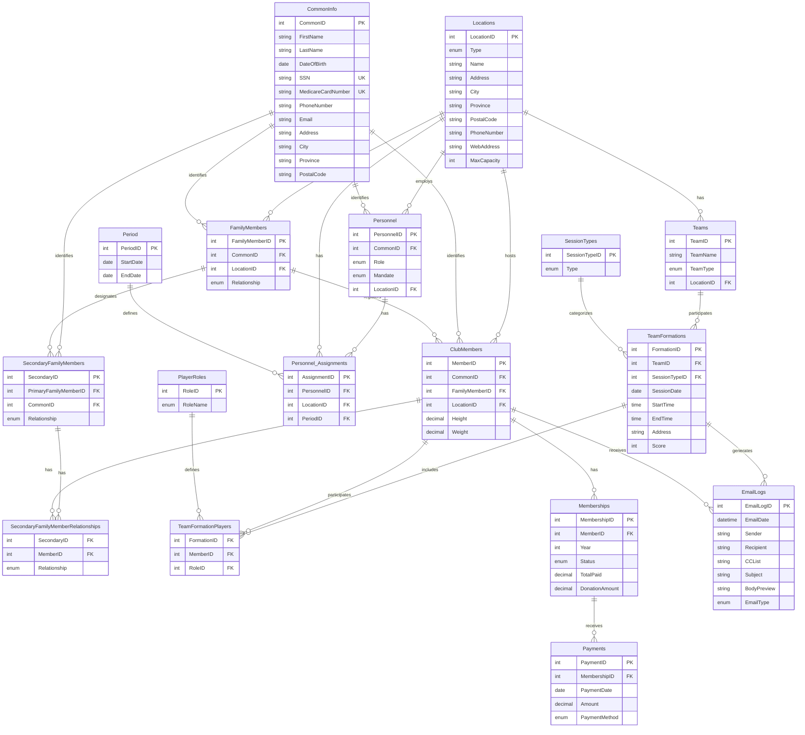

# E/R Diagram for MYVC Database System

## Constraints Not Captured in E/R Diagram

1. **Age Constraints**:
   - Club members must be between 11-18 years old
   - Trigger `validate_member_age` enforces this

2. **Time Conflict Constraints**:
   - Players cannot be assigned to sessions less than 3 hours apart
   - Trigger `validate_session_time_conflict` enforces this

3. **Membership Status**:
   - Members are inactive if fees are not paid
   - Automatic deactivation at age 18
   - Trigger `check_member_age_monthly` handles this

4. **Team Formation Rules**:
   - All players in a team must be from the same location
   - Teams must be either all boys or all girls
   - Each team must have exactly one captain

5. **Payment Rules**:
   - Maximum 4 installments per year
   - Excess over $100 is considered donation
   - Annual fee is $100

6. **Email Generation Rules**:
   - Weekly emails for upcoming sessions
   - Monthly age check and deactivation emails
   - Email logging requirements 